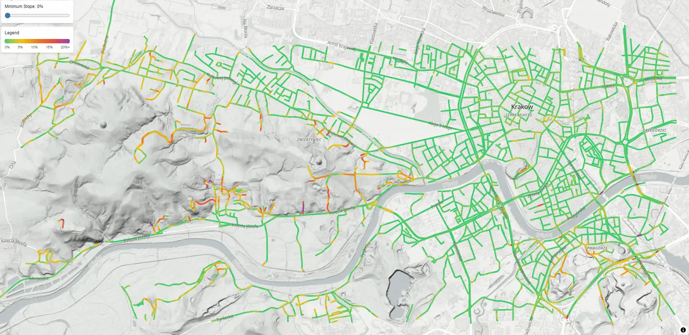
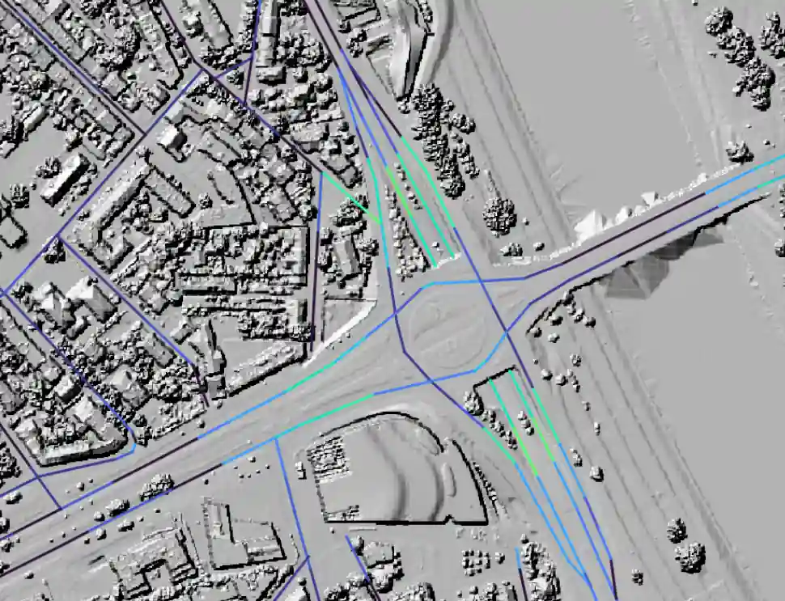
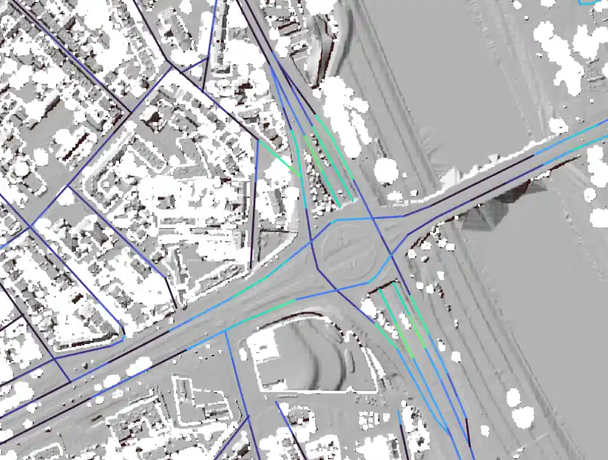

# Dokumentacja
Obliczanie nachylenia ulic z Numerycznego Modelu Terenu, Numerycznego Pokrycia Terenu i OSM.


### Członkowie zespołu:
- Mateusz Strzałkowski
- Jan Zakrzewski

## Instalacja i uruchamianie

1. Uruchom kontenery (bazę danych PostGIS oraz kontener z narzędziami):
    ```bash
    podman compose up -d
    ```

2. Wejdź do interaktywnej powłoki kontenera narzędziowego:
    ```bash
    podman exec -it 10-osm-street-gradients-pl_geotools_1 bash
    ```

3. Wewnątrz kontenera ustaw obszar obliczeń (bounding box) i uruchom główny skrypt przetwarzający. 
Bounding box można przekazać przez zmienne środowiskowe

    ```bash
    source bbox_debniki.sh
    ./main_geotools.sh
    ```
    lub jako parametry
    ```bash
    ./main_geotools.sh 50.04786 50.05265 19.92424 19.93431
    ```
    Zostaną pobrane NMT, NMPT oraz dane dróg OSM. Na ich podstawie policzone będzie nachylenie ulic.
    
4. Wyniki można zobaczyć w programie QGIS, otwierając plik `street-gradients-visualization.qgs`.
Należy upewnić się, że Postgres jest dostępny na `localhost:5439`:

    ```bash
    ssh -L 5439:localhost:5439 ztb.lab.kis.agh.edu.pl
    ```

    Nachylenie ulic można wyeksportować do pliku GeoJSON: 
    ```bash
    ./export_geojson.sh > slope.geojson
    ```
    Plik można wyświetlić otwierając `viewer.html` w przeglądarce.


## Sposób działania

1. Dwa kontenery: postgis oraz kontener z narzędziami (gdal, osm2pgsql itd.)
2. Tworzymy bazę
3. Pobieramy NMT jako GeoTIFF z usługi WCS i importujemy rastry za pomocą raster2pgsql
4. Pobieramy NMPT z usługi WCS:
    * możemy pobrać tylko image/x-aaigrid (ARC/INFO ASCII GRID)
        - to duże pliki, a serwer zwalnia wraz z rozmiarem, więc pobieramy w kilometrowych kawałkach
    * Przychodzi multipart zawierający aaigrid oraz plik .prj z projekcją (samo aaigrid nie wystarcza)
    * konwertujemy gdalem .asc wraz z .prj na GeoTiff, sprawdzamy, czy zakres przestrzenny się zgadza używając gdalinfo
    * Analizujemy szorstkość NMPT, aby wygenerować mapę "niepewności" (wykrywanie drzew)
    * Zapisujemy tylko kafelki .tif (z kompresją)
    * Importujemy wszystkie kawałki za pomocą raster2pgsql
5. Importujemy ulice za pomocą osm2pgsql
6. Tworzymy tabelę nachyleń:
    * ST_Segmentize - kroimy ulice na segmenty 50 m
    * st_nearestvalue - próbkujemy raster NMT, NMPT oraz mapę niepewności
    * Wybieramy wysokość z NMPT (dokładniejszy), chyba że mapa niepewności wskazuje drzewa - wtedy NMT
    * liczymy nachylenie jako różnicę pomiędzy początkiem a końcem segmentu

### Model danych

Tabele w PostGIS:
  * `dtm` – rastry NMT.
  * `dtcm` – rastry NMPT.
  * `dtcm_doubt` – rastry NMPT po wykryciu drzew.
  * `ways` – ulice z OSM: 
    * `kind`
    * `name`
    * `bridge`
    * `layer`
    * `geom`
  * `slope_static` – wyniki obliczeń: 
    * `segment_id`
    * `way_id`
    * `name`
    * `geom`
    * `slope`
    * `delta_h`
    * `nmt_h_a`, `nmt_h_b`
    * `nmpt_h_a`, `nmpt_h_b`
    * `nmpt_doubt_a`, `nmpt_doubt_b`


### Pobieranie NMT i NMPT (numerycznego modelu terenu) – wyzwania i frustracje
Na stronach:
* https://www.geoportal.gov.pl/pl/dane/numeryczny-model-terenu-nmt/
* https://www.geoportal.gov.pl/pl/dane/numeryczny-model-pokrycia-terenu-nmpt/
opisano sposoby dostępu do numerycznego modelu terenu (poziom gruntu) i numerycznego modelu pokrycia terenu (grunt + budynki), który może byc istotny ze względu na mosty.
Właściwe adresy usług WCS (Web Coverage Service) są trzy:
1. NMT  (1): https://mapy.geoportal.gov.pl/wss/service/PZGIK/NMT/GRID1/WCS/DigitalTerrainModel
2. NMT  (2): https://mapy.geoportal.gov.pl/wss/service/PZGIK/NMT/GRID1/WCS/DigitalTerrainModelFormatTIFF
2. NMPT (1): https://mapy.geoportal.gov.pl/wss/service/PZGIK/NMPT/GRID1/WCS/DigitalSurfaceModel
Aby uzyskać metadane i obsługiwane parametry, wysłać zapytanie na taki adres z parametrem REQUEST=GetCapabilities, np.

https://mapy.geoportal.gov.pl/wss/service/PZGIK/NMT/GRID1/WCS/DigitalTerrainModel?SERVICE=WCS&REQUEST=GetCapabilities
Otrzymamy plik .xml, w którym znajdziemy kilka koniecznych informacji (zob. WCS_capabilities_example.xml)
1. Obsługiwane układy wysokościowe:
    (Trzeba w zapytaniu podać układ, bo inaczej dostaniemy błąd)
    * DTM_PL-KRON86-NH
    * DTM_PL-EVRF2007-NH
2. Obsługiwane formaty wyjściowe:

Dla Adresów 1. i 3 otrzymujemy:
```
 <wcs:ServiceMetadata>
    <wcs:formatSupported>image/x-aaigrid</wcs:formatSupported>
    <wcs:formatSupported>image/png</wcs:formatSupported>
    <wcs:formatSupported>image/jpeg</wcs:formatSupported>
    <wcs:formatSupported>image/png; mode=8bit</wcs:formatSupported>
    <wcs:formatSupported>image/vnd.jpeg-png</wcs:formatSupported>
    <wcs:formatSupported>image/vnd.jpeg-png8</wcs:formatSupported>
    <wcs:formatSupported>image/tiff</wcs:formatSupported>
```

Format x-aaigrid (ARC/INFO ASCII GRID) jest prostą listą wartości.
```
ncols        500
nrows        500
xllcorner    561000.000000000000
yllcorner    236000.000000000000
cellsize     2.000000000000
 214.44000244140625 214.44000244140625 ... i tak do końca pliku
```
Ma on jednak kilka wad:

1. Pliki są potwornie wielkie, bo każda liczba zajmuje ok.19 bajtów.
2. Metadane nie wystarczają do pełnego odtworzenia układu współrzędnych.
    - W szczególności gdal wywołany na takim samotnym pliku .asc potrafi obrócić go w pionie (względem długości geogr.)
    - Dlatego zamiast pojedynczego pliku, serwer geoportalu w odpowiedzi zwraca multipart z trzema plikami
        - result.asc - aaigrid (właściwe dane)
        - result.prj - układ odniesienia jako WKT
        - result.asc.aux.xml - nieistotny (?)

Próba pobrania aaigrid dla nieco większego obszaru kończy się zerwaniem połączenia po dłużyszm czasie. Nawet gdy pobieramy poszczególne kawałki, serwer wydaje się miec limit transferu i dość szybko przestaje odpowiadać.

Wydaje się, że to nie problem, przecież serwer ogłosił, że obsługuje lepsze formaty, skompresowane, nie zużywające tyle transferu - GeoTiff, jpeg, png.

Problem w tym, że jeśli zmienimy parametr i zamiast `FORMAT=image/x-aaigrid` wyślemy `FORMAT=image/tiff` (png, albo jpg też), to istotnie dostaniemy obrazek, jednakże z nieusuwalnymi artefaktami.
Przykład widzimy na obrazku: 

Wygląda to jakby każdy wewnętrzny kafalek na serwerze został źle zrzutowany przy generowaniu obrazu. Pobieżny przegląd internetu sugeruje, być może serwer geoportalu (być może GeoServer, lub pochodna) jest domyślnie skonfigurowany aby generować obrazki, jednak robi to źle.

Oficjalna dokumentacja (https://www.geoportal.gov.pl/pl/usluga/uslugi-pobierania-wcs/) opisuje adres jednie jako `	Numeryczny Model Pokrycia Terenu – Arc/Info ASCII Grid`, nie wspomina o obrazkach, które znalazły się w metadanych usługi wcs chyba przez przypadek.

## Wyniki

Wizualizacja nachylenia ulic w programie QGIS (`street-gradients-visualization.qgs`):

Kropkami zaznaczone jest sto najbardziej stromych segmentów.


Wizualizacja wyeksportowanego pliku GeoJSON (`viewer.html`):




Porównanie obliczenia nachylenia na podstawie NMT i NMPT:

| NMT | NMPT | NMPT bez drzew |
|-----|------|-----------------|
|  |  |  |

